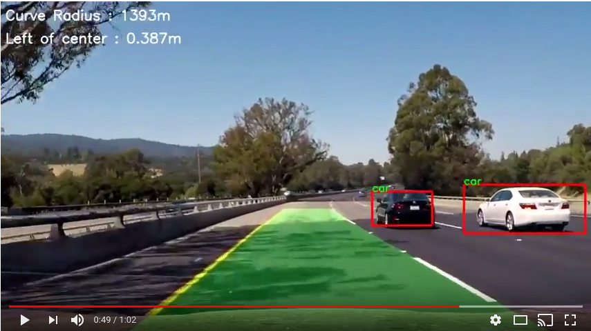

# Vehicle Detection and Tracking

Object detection and tracking for vehicles onboard camera using either an OpenCV method or the YOLO Darkflow Convolutional neural network (CNN) library. This is project 5 of the Udacity Self-driving car nano degree, Vehicle Detection and Tracking submission. This project uses two different forms of implementation.
1. SVM classifier using HOG and colour bin features.
2. [Fast YOLO](https://arxiv.org/pdf/1612.08242.pdf) method using the python wrapper [darkflow](https://github.com/thtrieu/darkflow). The code is available on [github](https://github.com/thtrieu/darkflow).

For a detailed description and walkthrough of the key areas of the code, visit the project website [here](https://www.haidynmcleod.com/object-detection).

[//]: # (Image References)
[image1]: ./output_images/YOLO_test1.jpg
[image2]: ./output_images/objects_test1.jpg

A video of the object detection in action can be seen below.

[](https://youtu.be/8O_-bWPyUX8)

## Project website

This repository has an accompanying project page, contains the theory and details behind the code. It can be found [here](https://www.haidynmcleod.com/object-detection).

## Getting Started

Download and unzip or clone this repository onto your local machine with

```sh
$ git clone https://github.com/Heych88/udacity-sdcnd-vehicle-detection-and-tracking.git
```

### Prerequisites

This project requires python 3 and the following libraries installed.

* OpenCv
* Tensorflow
* numpy
  * `$ pip3 install --user numpy`
* sklearn
  * `$ pip3 install --user scikit-learn`
* scipy
  * `$ pip3 install --user scipy`


### Installing

This repository only contains the code for the *VM classifier using HOG and colour bin features*.

##### Installing Fast-Yolo
To use the [Fast YOLO](https://arxiv.org/pdf/1612.08242.pdf) method, download the python wrapper [darkflow](https://github.com/thtrieu/darkflow) as outlined in the [darkflow README.md](https://github.com/thtrieu/darkflow/blob/master/README.md).
**Note: follow the 'Getting Started' installation before proceeding.**

Once extracted or cloned, copy the folders `cfg`, `cython_utils`, `dark`, `net` and utils into the location of this repositories directory. Add a folder named `bin` and store the downloaded *Tiny YOLO* weight file from the *VOC2007+2012 section*, downloaded from [here](http://pjreddie.com/darknet/yolo/) into that folder.

Open the project up in your favourite python ide and
In the file `objectdetection_YOLO.py`, uncomment the lines `from net.build import TFNet` and `self.tfnet = TFNet(options)` at lines 3 and 13.
In the file `main.py`, set the variable `use_yolo = True`

If all has been installed correctly, run `main.py` and the following image should appear.

![YOLO_test1.jpg][image1]


## Running the Code

Navigate to the directory of the repository in a terminal and run `main.py`.

```sh
$ cd <local directory>/udacity-sdcnd-advanced--lane-finding
$ python3 main.py
```

 The following image should appear.

![objects_test1.jpg][image2]


## Built With

* [darkflow](https://github.com/thtrieu/darkflow) - The YOLO framework used


## License

This project is licensed under the GNU General Public License v3.0 - see the [LICENSE.md](LICENSE.md) file for details.
